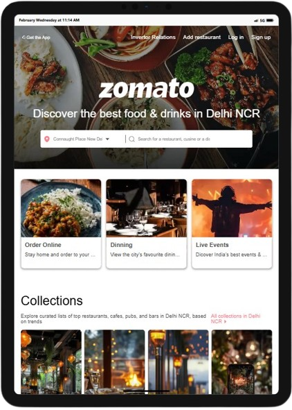
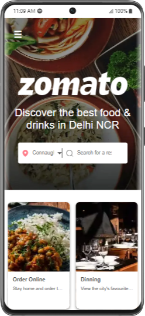

#  Landing Page 

Welcome to the Zomato Landing Page project! This project is a simple, responsive landing page for Zomato, a popular restaurant discovery and food delivery service.

## Table of Contents

- [Introduction](#introduction)
- [Features](#features)
- [Technologies Used](#technologies-used)

## Introduction

This project aims to create a visually appealing and user-friendly landing page for Zomato. It showcases the key features and services offered by Zomato, providing users with an engaging experience.

## Features

- Responsive design
- Clean and modern UI
- Easy navigation
- Highlighted key services

## Technologies Used

- HTML5
- CSS3
- JavaScript

## Demo Video

Here is a demo video of the Zomato Landing Page in action:

## Responsiveness

---

Thank you for visiting the Zomato Landing Page project! If you have any questions or feedback, feel free to reach out.
